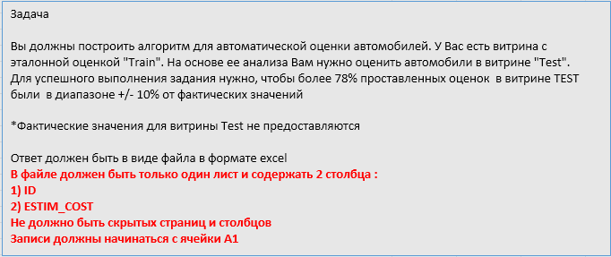

```{r setup}
library(readxl)
library(tidyverse)
library(GGally)
library(caret)
#setwd("D:\\projects\\kaspi analyst interview exercises")
set.seed(33)
```

###Load and process workbook
```{r}
xls_wbook <- "./task1.xlsx"
excel_sheets(xls_wbook) %>% print() -> sheet_names
```

```{r}
train_df <- read_excel(xls_wbook, sheet = "TRAIN")
test_df <- read_excel(xls_wbook, sheet = "TEST")

read_excel(xls_wbook, sheet = 1)
```



###EDA
```{r}
glimpse(train_df)
glimpse(test_df)

fctr_cols <- c("FUEL_TYPE", "BODY_TYPE", "TYPE_OF_DRIVE", "INTERIOR_TYPE", "TRANSM_TYPE", "AUTO_CONDITION")
train_df <- modify_at(train_df, fctr_cols, as.factor)
test_df <- modify_at(test_df, fctr_cols, as.factor)

summary(train_df)
summary(test_df)
```

```{r}
ggplot(train_df, aes(x=YEAR, y=ESTIM_COST, col=TYPE_OF_DRIVE)) + 
     geom_point(position = "jitter", alpha = 0.5) + 
     scale_y_log10() +
     geom_smooth(method = "lm", se = F) +
     facet_wrap(~AUTO_CONDITION)

ggplot(train_df,aes(x=log10(AVG_COST)))+
     geom_density(fill="red") +
     geom_density(aes(x=log10(ESTIM_COST)), fill="green", alpha=.5)

ggplot(train_df,aes(x=FUEL_TYPE,y=ESTIM_COST))+
     geom_boxplot()+
     scale_y_log10()+
     facet_wrap(~BODY_TYPE)+
     coord_flip()
```


First 3 symbols of VIN == World manufacturer identifier. Useless?
```{r}
train_df %>% unite(sep="", col = "VIN", num_range("VIN_", 1:3)) -> train_df
#train_df$VIN <- as.factor(train_df$VIN)

test_df %>% unite(sep="", col = "VIN", num_range("VIN_", 1:3)) -> test_df
#test_df$VIN <- as.factor(test_df$VIN)
train_df$VIN <- NULL
test_df$VIN <- NULL
```

Last 3 symbols of VIN == Sequential number == useless
```{r}
train_df %>% select(-num_range("VIN_", 15:17)) -> train_df
test_df %>% select(-num_range("VIN_", 15:17)) -> test_df
```

Plot correlation matrix:
```{r}
select_if(train_df[,-1], is.numeric) %>%
     ggcorr(label = TRUE)
```

NA?
```{r}
train_df %>% 
     map_dbl(~mean(is.na(.))) %>% 
     keep(~.>0)
```

Drop ID column
```{r}
train_df$ID <- NULL
```

```{r}
#train_dmy <- dummyVars("~.", data = train_df, fullRank = T)
#train_transformed <- data.frame(predict(train_dmy, newdata = train_df))

index <- createDataPartition(train_df$ESTIM_COST, p=0.75, list=FALSE)
sub_train <- train_df[index,]
sub_test <- train_df[-index,]
```

Fit linear model:
```{r}
model_lm <- lm(ESTIM_COST~., data = sub_train)

summary(model_lm)

broom::glance(model_lm)
```

Prediction on sub_test
```{r}
predicted_values <- predict(model_lm, newdata = sub_test)
sub_test$predicted <- predicted_values

ggplot(sub_test, aes(x = ESTIM_COST, y = predicted)) + 
     geom_point()+
     geom_abline()
```

Looks like there is no overfitting.

Finally, do prediction on test dataset:
```{r}
head(test_df)

test_df$ESTIM_COST <- predict(model_lm, newdata = test_df[,-1])
```

Save to file:
```{r}
library(xlsx)

select(test_df, ID, ESTIM_COST) %>% 
     mutate(ESTIM_COST = trunc(ESTIM_COST)) -> tmp_df

write.xlsx2(x = as.data.frame(tmp_df), file = "./Task1_Predicted.xlsx", col.names = TRUE, row.names = FALSE)
```


