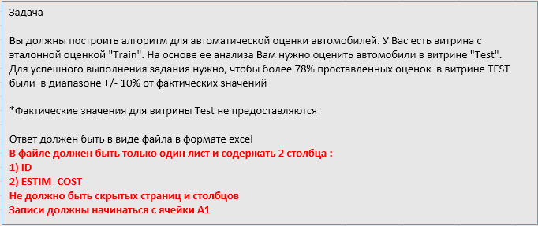

```r
library(readxl)
library(tidyverse)
```

```
## -- Attaching packages ---------------------------------- tidyverse 1.2.1 --
```

```
## v ggplot2 2.2.1     v purrr   0.2.4
## v tibble  1.4.2     v dplyr   0.7.4
## v tidyr   0.8.0     v stringr 1.3.0
## v readr   1.1.1     v forcats 0.3.0
```

```
## -- Conflicts ------------------------------------- tidyverse_conflicts() --
## x dplyr::filter() masks stats::filter()
## x dplyr::lag()    masks stats::lag()
```

```r
library(GGally)
```

```
## Warning: package 'GGally' was built under R version 3.4.4
```

```
## 
## Attaching package: 'GGally'
```

```
## The following object is masked from 'package:dplyr':
## 
##     nasa
```

```r
library(caret)
```

```
## Warning: package 'caret' was built under R version 3.4.4
```

```
## Loading required package: lattice
```

```
## 
## Attaching package: 'caret'
```

```
## The following object is masked from 'package:purrr':
## 
##     lift
```

```r
#setwd("D:\\projects\\kaspi analyst interview exercises")
set.seed(33)
```

###Load and process workbook

```r
xls_wbook <- "./task1.xlsx"
excel_sheets(xls_wbook) %>% print() -> sheet_names
```

```
## [1] "Описание полей" "TRAIN"          "TEST"
```


```r
train_df <- read_excel(xls_wbook, sheet = "TRAIN")
test_df <- read_excel(xls_wbook, sheet = "TEST")

read_excel(xls_wbook, sheet = 1)
```

```
## # A tibble: 10 x 1
##    `Описание полей`                                                      
##    <chr>                                                                 
##  1 YEAR – возраст авто (год оценки – год выпуска авто)                   
##  2 VIN_TOTAL – полный ВИН-код и далее каждый из 17 символов в отдельности
##  3 ENGINE_VOLUME – объем двигателя                                       
##  4 FUEL_TYPE – тип топлива                                               
##  5 BODY_TYPE – тип кузова                                                
##  6 TYPE_OF_DIVE – тип привода                                            
##  7 INTERIOR_TYPE – тип салона                                            
##  8 TRANSM_TYPE – тип КПП                                                 
##  9 AUTO_CONDITION – тех. состояние авто                                  
## 10 AVG_COST – средн. рыночная стоимость
```



###EDA

```r
glimpse(train_df)
```

```
## Observations: 6,000
## Variables: 17
## $ ID             <dbl> 0, 1, 2, 3, 4, 5, 6, 7, 8, 9, 10, 11, 12, 13, 1...
## $ YEAR           <dbl> 9, 10, 17, 4, 17, 9, 13, 8, 10, 8, 1, 3, 13, 1,...
## $ VIN_1          <chr> "J", "N", "W", "K", "J", "J", "J", "J", "4", "K...
## $ VIN_2          <chr> "M", "M", "A", "M", "A", "T", "H", "M", "T", "M...
## $ VIN_3          <chr> "Y", "T", "U", "H", "4", "H", "L", "Y", "1", "H...
## $ VIN_15         <dbl> 1, 1, 8, 9, 4, 9, 4, 9, 0, 7, 6, 3, 2, 7, 0, 1,...
## $ VIN_16         <dbl> 0, 8, 9, 1, 3, 1, 1, 4, 0, 8, 1, 9, 7, 1, 5, 0,...
## $ VIN_17         <dbl> 2, 0, 7, 8, 1, 5, 6, 1, 5, 4, 5, 3, 2, 2, 9, 9,...
## $ ENGINE_VOLUME  <dbl> 3.0, 1.6, 2.4, 1.6, 3.0, 3.0, 2.0, 3.0, 2.4, 2....
## $ FUEL_TYPE      <chr> "Бензин-Газ", "Бензин", "Бензин", "Бензин", "Бе...
## $ BODY_TYPE      <chr> "Внедорожник", "Седан", "Седан", "Седан", "Внед...
## $ TYPE_OF_DRIVE  <chr> "Полный привод", "Передний привод", "Передний п...
## $ INTERIOR_TYPE  <chr> "КОЖА", "ВЕЛЮР", "ВЕЛЮР", "ВЕЛЮР", "КОЖА", "КОЖ...
## $ TRANSM_TYPE    <chr> "АКПП", "МКПП", "АКПП", "АКПП", "АКПП", "АКПП",...
## $ AUTO_CONDITION <chr> "Удовлетворительное", "Удовлетворительное", "Уд...
## $ AVG_COST       <dbl> 5725926, 2211538, 1260976, 3287778, 2028916, 52...
## $ ESTIM_COST     <dbl> 4688000, 1853000, 1000000, 3150000, 1603000, 49...
```

```r
glimpse(test_df)
```

```
## Observations: 3,249
## Variables: 16
## $ ID             <dbl> 10000, 10001, 10002, 10003, 10004, 10005, 10006...
## $ YEAR           <dbl> 13, 10, 5, 1, 10, 2, 9, 9, 4, 2, 4, 10, 12, 6, ...
## $ VIN_1          <chr> "J", "J", "K", "J", "J", "X", "J", "6", "X", "X...
## $ VIN_2          <chr> "M", "T", "M", "T", "N", "7", "T", "T", "7", "W...
## $ VIN_3          <chr> "Z", "M", "H", "H", "8", "L", "N", "1", "L", "8...
## $ VIN_15         <dbl> 1, 1, 0, 0, 3, 3, 8, 5, 0, 8, 2, 2, 8, 7, 5, 8,...
## $ VIN_16         <dbl> 6, 6, 4, 3, 0, 8, 2, 2, 4, 9, 8, 1, 6, 4, 0, 9,...
## $ VIN_17         <dbl> 6, 4, 7, 5, 2, 2, 4, 7, 0, 5, 7, 3, 3, 0, 6, 2,...
## $ ENGINE_VOLUME  <dbl> 2.0, 2.4, 2.0, 3.5, 2.5, 1.6, 1.6, 2.4, 1.6, 1....
## $ FUEL_TYPE      <chr> "Бензин", "Бензин", "Бензин-Газ", "Бензин", "Бе...
## $ BODY_TYPE      <chr> "Минивэн", "Кроссовер", "Кроссовер", "Седан", "...
## $ TYPE_OF_DRIVE  <chr> "Передний привод", "Полный привод", "Полный при...
## $ INTERIOR_TYPE  <chr> "ВЕЛЮР", "ВЕЛЮР", "КОМБИНИРОВАННЫЙ", "КОЖА", "В...
## $ TRANSM_TYPE    <chr> "АКПП", "АКПП", "АКПП", "АКПП", "АКПП", "МКПП",...
## $ AUTO_CONDITION <chr> "Удовлетворительное", "Удовлетворительное", "Уд...
## $ AVG_COST       <dbl> 1734884, 4315385, 5110811, 17560000, 3334146, 2...
```

```r
fctr_cols <- c("FUEL_TYPE", "BODY_TYPE", "TYPE_OF_DRIVE", "INTERIOR_TYPE", "TRANSM_TYPE", "AUTO_CONDITION")
train_df <- modify_at(train_df, fctr_cols, as.factor)
test_df <- modify_at(test_df, fctr_cols, as.factor)

summary(train_df)
```

```
##        ID            YEAR          VIN_1              VIN_2          
##  Min.   :   0   Min.   : 0.00   Length:6000        Length:6000       
##  1st Qu.:1500   1st Qu.: 4.00   Class :character   Class :character  
##  Median :3000   Median : 9.00   Mode  :character   Mode  :character  
##  Mean   :3000   Mean   : 8.19                                        
##  3rd Qu.:4499   3rd Qu.:11.00                                        
##  Max.   :5999   Max.   :19.00                                        
##                                                                      
##     VIN_3               VIN_15          VIN_16          VIN_17     
##  Length:6000        Min.   :0.000   Min.   :0.000   Min.   :0.000  
##  Class :character   1st Qu.:2.000   1st Qu.:2.000   1st Qu.:2.000  
##  Mode  :character   Median :4.000   Median :5.000   Median :4.000  
##                     Mean   :4.429   Mean   :4.517   Mean   :4.462  
##                     3rd Qu.:7.000   3rd Qu.:7.000   3rd Qu.:7.000  
##                     Max.   :9.000   Max.   :9.000   Max.   :9.000  
##                     NA's   :5       NA's   :5       NA's   :6      
##  ENGINE_VOLUME      FUEL_TYPE              BODY_TYPE   
##  Min.   :1.0   Бензин    :5067   Внедорожник    : 446  
##  1st Qu.:1.6   Бензин-Газ: 725   Кроссовер      :1099  
##  Median :2.4   Газ       :  16   Минивэн        : 101  
##  Mean   :2.3   Гибрид    :  34   Пикап          :  50  
##  3rd Qu.:2.7   Дизель    : 158   Седан          :3475  
##  Max.   :5.7                     Универсал      : 201  
##                                  Хэтчбек/Лифтбек: 628  
##          TYPE_OF_DRIVE          INTERIOR_TYPE  TRANSM_TYPE
##  Задний привод  : 307   ВЕЛЮР          :3583   АКПП:5025  
##  Передний привод:4082   КОЖА           :2215   МКПП: 975  
##  Полный привод  :1611   КОМБИНИРОВАННЫЙ: 202              
##                                                           
##                                                           
##                                                           
##                                                           
##             AUTO_CONDITION    AVG_COST          ESTIM_COST      
##  Отличное          : 905   Min.   :  620988   Min.   :  700000  
##  Удовлетворительное:3049   1st Qu.: 2492960   1st Qu.: 2146250  
##  Хорошее           :2046   Median : 3160008   Median : 2732000  
##                            Mean   : 3691070   Mean   : 3274294  
##                            3rd Qu.: 4297954   3rd Qu.: 3824000  
##                            Max.   :22664835   Max.   :23059000  
## 
```

```r
summary(test_df)
```

```
##        ID             YEAR           VIN_1              VIN_2          
##  Min.   :10000   Min.   : 0.000   Length:3249        Length:3249       
##  1st Qu.:10812   1st Qu.: 4.000   Class :character   Class :character  
##  Median :11624   Median : 9.000   Mode  :character   Mode  :character  
##  Mean   :11624   Mean   : 8.273                                        
##  3rd Qu.:12436   3rd Qu.:12.000                                        
##  Max.   :13248   Max.   :19.000                                        
##                                                                        
##     VIN_3               VIN_15          VIN_16          VIN_17     
##  Length:3249        Min.   :0.000   Min.   :0.000   Min.   :0.000  
##  Class :character   1st Qu.:2.000   1st Qu.:2.000   1st Qu.:2.000  
##  Mode  :character   Median :5.000   Median :5.000   Median :4.000  
##                     Mean   :4.601   Mean   :4.479   Mean   :4.412  
##                     3rd Qu.:7.000   3rd Qu.:7.000   3rd Qu.:7.000  
##                     Max.   :9.000   Max.   :9.000   Max.   :9.000  
##                     NA's   :4       NA's   :4       NA's   :12     
##  ENGINE_VOLUME        FUEL_TYPE              BODY_TYPE   
##  Min.   :1.000   Бензин    :2738   Внедорожник    : 243  
##  1st Qu.:1.600   Бензин-Газ: 393   Кроссовер      : 587  
##  Median :2.200   Газ       :  16   Минивэн        :  48  
##  Mean   :2.287   Гибрид    :   9   Пикап          :  29  
##  3rd Qu.:2.600   Дизель    :  93   Седан          :1937  
##  Max.   :5.600                     Универсал      : 114  
##                                    Хэтчбек/Лифтбек: 291  
##          TYPE_OF_DRIVE          INTERIOR_TYPE  TRANSM_TYPE
##  Задний привод  : 174   ВЕЛЮР          :1907   АКПП:2694  
##  Передний привод:2228   КОЖА           :1239   МКПП: 555  
##  Полный привод  : 847   КОМБИНИРОВАННЫЙ: 103              
##                                                           
##                                                           
##                                                           
##                                                           
##             AUTO_CONDITION    AVG_COST       
##  Отличное          : 474   Min.   :  606173  
##  Удовлетворительное:1721   1st Qu.: 2461905  
##  Хорошее           :1054   Median : 3151163  
##                            Mean   : 3669968  
##                            3rd Qu.: 4292593  
##                            Max.   :22323333  
## 
```


```r
ggplot(train_df, aes(x=YEAR, y=ESTIM_COST, col=TYPE_OF_DRIVE)) + 
     geom_point(position = "jitter", alpha = 0.5) + 
     scale_y_log10() +
     geom_smooth(method = "lm", se = F) +
     facet_wrap(~AUTO_CONDITION)
```

<!-- -->

```r
ggplot(train_df,aes(x=log10(AVG_COST)))+
     geom_density(fill="red") +
     geom_density(aes(x=log10(ESTIM_COST)), fill="green", alpha=.5)
```

<!-- -->

```r
ggplot(train_df,aes(x=FUEL_TYPE,y=ESTIM_COST))+
     geom_boxplot()+
     scale_y_log10()+
     facet_wrap(~BODY_TYPE)+
     coord_flip()
```

<!-- -->


First 3 symbols of VIN == World manufacturer identifier. Useless?

```r
train_df %>% unite(sep="", col = "VIN", num_range("VIN_", 1:3)) -> train_df
#train_df$VIN <- as.factor(train_df$VIN)

test_df %>% unite(sep="", col = "VIN", num_range("VIN_", 1:3)) -> test_df
#test_df$VIN <- as.factor(test_df$VIN)
train_df$VIN <- NULL
test_df$VIN <- NULL
```

Last 3 symbols of VIN == Sequential number == useless

```r
train_df %>% select(-num_range("VIN_", 15:17)) -> train_df
test_df %>% select(-num_range("VIN_", 15:17)) -> test_df
```

Plot correlation matrix:

```r
select_if(train_df[,-1], is.numeric) %>%
     ggcorr(label = TRUE)
```

<!-- -->

NA?

```r
train_df %>% 
     map_dbl(~mean(is.na(.))) %>% 
     keep(~.>0)
```

```
## named numeric(0)
```

Drop ID column

```r
train_df$ID <- NULL
```


```r
#train_dmy <- dummyVars("~.", data = train_df, fullRank = T)
#train_transformed <- data.frame(predict(train_dmy, newdata = train_df))

index <- createDataPartition(train_df$ESTIM_COST, p=0.75, list=FALSE)
sub_train <- train_df[index,]
sub_test <- train_df[-index,]
```

Fit linear model:

```r
model_lm <- lm(ESTIM_COST~., data = sub_train)

summary(model_lm)
```

```
## 
## Call:
## lm(formula = ESTIM_COST ~ ., data = sub_train)
## 
## Residuals:
##      Min       1Q   Median       3Q      Max 
## -2397190  -147976    -3649   135232  5438107 
## 
## Coefficients:
##                                    Estimate Std. Error t value Pr(>|t|)
## (Intercept)                       1.100e+05  4.999e+04   2.200 0.027823
## YEAR                             -4.141e+03  1.797e+03  -2.304 0.021284
## ENGINE_VOLUME                     6.007e+03  1.230e+04   0.488 0.625364
## FUEL_TYPEБензин-Газ               3.351e+04  1.464e+04   2.289 0.022147
## FUEL_TYPEГаз                     -1.894e+05  9.548e+04  -1.984 0.047309
## FUEL_TYPEГибрид                   4.959e+03  6.115e+04   0.081 0.935365
## FUEL_TYPEДизель                  -7.853e+04  3.260e+04  -2.409 0.016056
## BODY_TYPEКроссовер               -1.123e+05  2.256e+04  -4.977 6.71e-07
## BODY_TYPEМинивэн                 -9.752e+04  4.463e+04  -2.185 0.028921
## BODY_TYPEПикап                   -4.499e+04  5.880e+04  -0.765 0.444243
## BODY_TYPEСедан                   -7.223e+04  2.722e+04  -2.654 0.007991
## BODY_TYPEУниверсал               -1.220e+05  3.395e+04  -3.592 0.000331
## BODY_TYPEХэтчбек/Лифтбек         -5.014e+04  3.198e+04  -1.568 0.116921
## TYPE_OF_DRIVEПередний привод      5.688e+04  2.311e+04   2.461 0.013895
## TYPE_OF_DRIVEПолный привод        3.769e+04  2.761e+04   1.365 0.172205
## INTERIOR_TYPEКОЖА                 1.292e+04  1.220e+04   1.059 0.289557
## INTERIOR_TYPEКОМБИНИРОВАННЫЙ      6.573e+04  2.627e+04   2.502 0.012392
## TRANSM_TYPEМКПП                   3.648e+04  1.402e+04   2.601 0.009317
## AUTO_CONDITIONУдовлетворительное -2.670e+05  1.501e+04 -17.788  < 2e-16
## AUTO_CONDITIONХорошее            -1.743e+05  1.522e+04 -11.454  < 2e-16
## AVG_COST                          9.189e-01  4.041e-03 227.381  < 2e-16
##                                     
## (Intercept)                      *  
## YEAR                             *  
## ENGINE_VOLUME                       
## FUEL_TYPEБензин-Газ              *  
## FUEL_TYPEГаз                     *  
## FUEL_TYPEГибрид                     
## FUEL_TYPEДизель                  *  
## BODY_TYPEКроссовер               ***
## BODY_TYPEМинивэн                 *  
## BODY_TYPEПикап                      
## BODY_TYPEСедан                   ** 
## BODY_TYPEУниверсал               ***
## BODY_TYPEХэтчбек/Лифтбек            
## TYPE_OF_DRIVEПередний привод     *  
## TYPE_OF_DRIVEПолный привод          
## INTERIOR_TYPEКОЖА                   
## INTERIOR_TYPEКОМБИНИРОВАННЫЙ     *  
## TRANSM_TYPEМКПП                  ** 
## AUTO_CONDITIONУдовлетворительное ***
## AUTO_CONDITIONХорошее            ***
## AVG_COST                         ***
## ---
## Signif. codes:  0 '***' 0.001 '**' 0.01 '*' 0.05 '.' 0.1 ' ' 1
## 
## Residual standard error: 314700 on 4480 degrees of freedom
## Multiple R-squared:  0.9767,	Adjusted R-squared:  0.9766 
## F-statistic:  9404 on 20 and 4480 DF,  p-value: < 2.2e-16
```

```r
broom::glance(model_lm)
```

```
##   r.squared adj.r.squared    sigma statistic p.value df    logLik      AIC
## 1 0.9767341     0.9766302 314741.2  9403.805       0 21 -63356.55 126757.1
##        BIC    deviance df.residual
## 1 126898.2 4.43798e+14        4480
```

Prediction on sub_test

```r
predicted_values <- predict(model_lm, newdata = sub_test)
sub_test$predicted <- predicted_values

ggplot(sub_test, aes(x = ESTIM_COST, y = predicted)) + 
     geom_point()+
     geom_abline()
```

<!-- -->

Looks like there is no overfitting.

Finally, do prediction on test dataset:

```r
head(test_df)
```

```
## # A tibble: 6 x 10
##       ID  YEAR ENGINE_VOLUME FUEL_TYPE  BODY_TYPE TYPE_OF_DRIVE  
##    <dbl> <dbl>         <dbl> <fct>      <fct>     <fct>          
## 1 10000.   13.          2.00 Бензин     Минивэн   Передний привод
## 2 10001.   10.          2.40 Бензин     Кроссовер Полный привод  
## 3 10002.    5.          2.00 Бензин-Газ Кроссовер Полный привод  
## 4 10003.    1.          3.50 Бензин     Седан     Передний привод
## 5 10004.   10.          2.50 Бензин     Кроссовер Полный привод  
## 6 10005.    2.          1.60 Бензин     Седан     Передний привод
## # ... with 4 more variables: INTERIOR_TYPE <fct>, TRANSM_TYPE <fct>,
## #   AUTO_CONDITION <fct>, AVG_COST <dbl>
```

```r
test_df$ESTIM_COST <- predict(model_lm, newdata = test_df[,-1])
```

Save to file:

```r
library(xlsx)
```

```
## Loading required package: rJava
```

```
## Loading required package: xlsxjars
```

```r
select(test_df, ID, ESTIM_COST) %>% 
     mutate(ESTIM_COST = trunc(ESTIM_COST)) -> tmp_df

write.xlsx2(x = as.data.frame(tmp_df), file = "./Task1_Predicted.xlsx", col.names = TRUE, row.names = FALSE)
```


