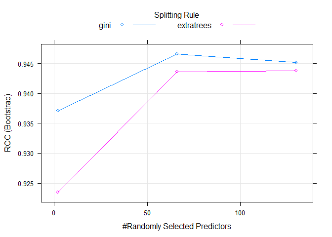

```r
library(readxl)
library(tidyverse)
```

```
## -- Attaching packages ---------------------------------- tidyverse 1.2.1 --
```

```
## v ggplot2 2.2.1     v purrr   0.2.4
## v tibble  1.4.2     v dplyr   0.7.4
## v tidyr   0.8.0     v stringr 1.3.0
## v readr   1.1.1     v forcats 0.3.0
```

```
## -- Conflicts ------------------------------------- tidyverse_conflicts() --
## x dplyr::filter() masks stats::filter()
## x dplyr::lag()    masks stats::lag()
```

```r
library(GGally)
```

```
## Warning: package 'GGally' was built under R version 3.4.4
```

```
## 
## Attaching package: 'GGally'
```

```
## The following object is masked from 'package:dplyr':
## 
##     nasa
```

```r
library(caret)
```

```
## Warning: package 'caret' was built under R version 3.4.4
```

```
## Loading required package: lattice
```

```
## 
## Attaching package: 'caret'
```

```
## The following object is masked from 'package:purrr':
## 
##     lift
```

```r
set.seed(44)
```

###Load and process workbook

```r
xls_wbook <- "./task2.xlsx"
excel_sheets(xls_wbook) %>% print() -> sheet_names
```

```
## [1] "условия"         "Мошенники_train" "Мошенники_test"
```


```r
train_df <- read_excel(xls_wbook, sheet = "Мошенники_train", col_types = "text")
test_df <- read_excel(xls_wbook, sheet = "Мошенники_test", col_types = "text")

read_excel(xls_wbook, sheet = 1)
```

```
## # A tibble: 8 x 1
##   `ЗАДАЧА №2. Мошенники`                                                  
##   <chr>                                                                   
## 1 "Вы работаете в крупной компании \"рога и копыта\". Ваша задача выявлят~
## 2 Для этого, у вас имеются 2 витрины данных «train» и «test». Они содержа~
## 3 В витрине train поле target показывает, кто из клиентов является мошенн~
## 4 Ваша задача - классифицировать витрину «test» и проставить в ней аналог~
## 5 <NA>                                                                    
## 6 Правила оформления реузльтатов                                          
## 7 Результат по кейсам должен содержать:                                   
## 8 "3) Результат кейса №2: формат Excel. В файле должен быть только один л~
```


```r
train_df$F120 <- str_replace_all(train_df$F120, "\\s", "")
test_df$F120 <- str_replace_all(test_df$F120, "\\s", "")
test_df$F120 <- str_replace_all(test_df$F120, "СРЕПЕНЬ", "СТЕПЕНЬ")

train_df$TARGET <- str_replace_all(train_df$TARGET, "0", "NO")
train_df$TARGET <- str_replace_all(train_df$TARGET, "1", "YES")
table(train_df$TARGET)
```

```
## 
##    NO   YES 
## 19307 10693
```

```r
guess_coltypes <- map_chr(train_df, guess_parser)

table(guess_coltypes)
```

```
## guess_coltypes
## character    double   integer 
##         2       129         1
```

```r
train_df <- modify_at(train_df, names(keep(guess_coltypes, ~.=="integer")), as.integer)
train_df <- modify_at(train_df, names(keep(guess_coltypes, ~.=="character")), as.character)
train_df <- modify_at(train_df, names(keep(guess_coltypes, ~.=="double")), as.double)
train_df <- modify_at(train_df, c("F120", "TARGET"), as.factor)

test_df <- modify_at(test_df, names(keep(guess_coltypes, ~.=="integer")), as.integer)
test_df <- modify_at(test_df, names(keep(guess_coltypes, ~.=="character")), as.character)
test_df <- modify_at(test_df, names(keep(guess_coltypes, ~.=="double")), as.double)
test_df <- modify_at(test_df, c("F120", "TARGET"), as.factor)

glimpse(train_df)
```

```
## Observations: 30,000
## Variables: 132
## $ NUM    <int> 0, 1, 2, 3, 4, 5, 6, 7, 8, 9, 10, 11, 12, 13, 14, 15, 1...
## $ F0     <dbl> 0, 0, 0, 2, 0, 0, 0, 0, 0, 1, 7, 2, 0, 0, 0, 0, 1, 1, 1...
## $ F1     <dbl> 1.000000, 0.000000, 0.000000, 10.000000, 5.000000, 0.00...
## $ F2     <dbl> 1.0000000, 0.0000000, 0.0000000, 1.0000000, 4.0000000, ...
## $ F3     <dbl> 199900.0, 0.0, 0.0, 1187750.0, 318771.0, 0.0, 0.0, 1799...
## $ F4     <dbl> 0.0, 0.0, 0.0, 130990.0, 0.0, 0.0, 0.0, 0.0, 0.0, 24990...
## $ F5     <dbl> 1.000000, 0.000000, 0.000000, 6.000000, 4.000000, 0.000...
## $ F6     <dbl> 0, 0, 0, 0, 0, 0, 0, 0, 0, 0, 1, 1, 1, 0, 0, 0, 0, 0, 0...
## $ F7     <dbl> 1.000000, 0.000000, 0.000000, 2.000000, 1.000000, 0.000...
## $ F8     <dbl> 0.000000, 0.000000, 2.000000, 0.000000, 0.000000, 0.000...
## $ F9     <dbl> 0.0000000, 0.0000000, 2.0000000, 0.0000000, 0.0000000, ...
## $ F10    <dbl> 3.0000000, 0.0000000, 0.0000000, 0.0000000, 0.0000000, ...
## $ F11    <dbl> 2.0000000, 0.0000000, 0.0000000, 0.0000000, 0.0000000, ...
## $ F12    <dbl> 49725.00, 2121.00, 2121.00, 2121.00, 57831.00, NA, 2121...
## $ F13    <dbl> 5.000000, 0.000000, 0.000000, 0.000000, 5.000000, 2.841...
## $ F14    <dbl> 1.0000000, 0.0000000, 0.0000000, 0.0000000, 1.0000000, ...
## $ F15    <dbl> 120.0000, NA, NA, NA, 179.0000, NA, NA, 31.0000, 122.61...
## $ F16    <dbl> 0.0000000, 0.0000000, 0.0000000, 0.0000000, 0.0000000, ...
## $ F17    <dbl> 1.0000000, 0.0000000, 0.0000000, 0.0000000, 1.0000000, ...
## $ F18    <dbl> 0, 1, 1, 1, 0, 0, 1, 0, 0, 1, 0, 0, 1, 0, 0, 1, 0, 0, 0...
## $ F19    <dbl> 0, 1, 1, 1, 0, 0, 1, 1, 0, 1, 0, 0, 1, 0, 0, 1, 0, 0, 0...
## $ F20    <dbl> 0.00000, 17.00000, 4.00000, 5.00000, 6.00000, 47.00000,...
## $ F21    <dbl> 0.000000, 1.000000, 4.000000, 5.000000, 6.000000, 9.000...
## $ F22    <dbl> 276677.3, 142918.0, 276677.3, 276677.3, 156218.0, 90000...
## $ F23    <dbl> 0, 0, 0, 0, 0, 4, 0, 0, 0, 0, 0, 0, 0, 0, 1, 0, 0, 0, 0...
## $ F24    <dbl> 0.0000000, 3.0000000, 0.0000000, 0.0000000, 1.0000000, ...
## $ F25    <dbl> 1.000000, 3.000000, 1.000000, 6.000000, 6.000000, 4.000...
## $ F26    <dbl> 34.00000, 111.00000, 5.00000, 6.00000, 10.00000, 49.031...
## $ F27    <dbl> 5.000000, 5.000000, 4.430142, 4.430142, 4.430142, 4.430...
## $ F28    <dbl> 1.0000000, 0.0000000, 0.0000000, 0.0000000, 0.0000000, ...
## $ F29    <dbl> 660000.00, 125000.00, 120005.00, 144500.00, 125000.00, ...
## $ F30    <dbl> 34.00000, 32.00000, 23.00000, 21.00000, 24.00000, 45.00...
## $ F31    <dbl> 6.0000, 876.0000, 499.3159, 88.0000, 32.0000, 499.3159,...
## $ F32    <dbl> 0.0000000, 5.0000000, 0.0000000, 1.0000000, 0.0000000, ...
## $ F33    <dbl> 0.000000, 0.000000, 0.000000, 0.000000, 0.000000, 0.000...
## $ F34    <dbl> 0.0000000, 3.0000000, 0.0000000, 1.0000000, 0.0000000, ...
## $ F35    <dbl> 0.0000000, 3.0000000, 0.0000000, 0.0000000, 0.0000000, ...
## $ F36    <dbl> 1.00000, 19.00000, 0.00000, 45.00000, 1.00000, 0.00000,...
## $ F37    <dbl> 1.00000, 0.00000, 0.00000, 29.00000, 7.00000, 0.00000, ...
## $ F38    <dbl> 220275.000, 92879.000, -2120.000, 62879.000, 27169.000,...
## $ F39    <dbl> 610275.00, 122879.00, 117884.00, 142379.00, 67169.00, 1...
## $ F40    <dbl> 0, 0, 0, 0, 0, 0, 0, 0, 0, 0, 0, 0, 0, 0, 0, 0, 1, 0, 0...
## $ F41    <dbl> 9.000000, 0.000000, 0.000000, 12.000000, 1.000000, 0.00...
## $ F42    <dbl> 1.0000000, 0.0000000, 0.0000000, 6.0000000, 1.0000000, ...
## $ F43    <dbl> 0.000000, 4.000000, 1.000000, 2.000000, 0.000000, 1.000...
## $ F44    <dbl> 0.00000, 100.00000, 33.33333, 100.00000, 0.00000, 100.0...
## $ F45    <dbl> 100.00000, 0.00000, 0.00000, 85.71429, 100.00000, 0.000...
## $ F46    <dbl> 2.461437, 42616.000000, 42491.000000, 2.461437, 2.46143...
## $ F47    <dbl> 199900.0, 0.0, 0.0, 198990.0, 154000.0, 0.0, 0.0, 22400...
## $ F48    <dbl> 0.000000, 0.000000, 2.000000, 0.000000, 0.000000, 0.000...
## $ F49    <dbl> 0.0000000, 0.0000000, 2.0000000, 0.0000000, 0.0000000, ...
## $ F50    <dbl> 0.0, 0.0, 50000.0, 0.0, 0.0, 0.0, 80000.0, 0.0, 0.0, 40...
## $ F51    <dbl> 1.000000e+00, 0.000000e+00, 0.000000e+00, 4.014493e+00,...
## $ F52    <dbl> 199900.00, 0.00, 0.00, 65135.36, 67756.44, 0.00, 0.00, ...
## $ F53    <dbl> 12.000000, 6.000000, 9.000000, 42500.000000, 22.000000,...
## $ F54    <dbl> 1.0000000, 0.0000000, 0.0000000, 2.0000000, 5.0000000, ...
## $ F55    <dbl> 0.00000, 2.00000, 0.00000, 1.00000, 0.00000, 0.00000, 0...
## $ F56    <dbl> 0.000000, 0.000000, 0.000000, 20.000000, 5.000000, 0.00...
## $ F57    <dbl> 1, 0, 0, 1, 0, 0, 0, 0, 0, 24, 131, 0, 0, 0, 0, 0, 1, 0...
## $ F58    <dbl> 1.558418e+00, 5.838947e+00, 9.666000e+05, 6.575385e+00,...
## $ F59    <dbl> 5.000000, 1977.000000, 160.000000, 182.000000, 238.0000...
## $ F60    <dbl> 0.0, 0.0, 30000.0, 0.0, 0.0, 0.0, 80000.0, 0.0, 0.0, 40...
## $ F61    <dbl> 199900.00, 0.00, 0.00, 23990.00, 31200.00, 0.00, 0.00, ...
## $ F62    <dbl> 1.000000, 1.000000, 1.000000, 1.000000, 2.000000, 2.000...
## $ F63    <dbl> 0.000000, 83.333333, 0.000000, 16.666667, 0.000000, 0.0...
## $ F64    <dbl> 1.000000, 0.000000, 0.000000, 6.000000, 4.000000, 0.000...
## $ F65    <dbl> 1.0000000, 0.0000000, 0.0000000, 9.0000000, 11.0000000,...
## $ F66    <dbl> 12.73464, 16.00000, 6.00000, 2.00000, 2.00000, 0.00000,...
## $ F67    <dbl> 0.000000, 1.000000, 0.000000, 0.000000, 0.000000, 2.000...
## $ F68    <dbl> 92019.53, 92019.53, 112700.00, 73100.00, 48000.00, 9201...
## $ F69    <dbl> 0, 1, 0, 0, 0, 0, 0, 0, 0, 0, 0, 0, 0, 0, 1, 0, 0, 0, 0...
## $ F70    <dbl> 0.0000000, 0.0000000, 1.0000000, 0.0000000, 0.0000000, ...
## $ F71    <dbl> 0.0000000, 1.0000000, 1.0000000, 1.0000000, 0.0000000, ...
## $ F72    <dbl> 1.00000000, 1.00000000, 1.00000000, 3.00000000, 0.00000...
## $ F73    <dbl> 1.0000000, 0.0000000, 0.0000000, 0.0000000, 0.0000000, ...
## $ F74    <dbl> 0.0000000, 0.0000000, 0.0000000, 4.0000000, 0.0000000, ...
## $ F75    <dbl> 100.0000, NA, 0.0000, 100.0000, 100.0000, NA, 133.0000,...
## $ F76    <dbl> 1, 1, 0, 1, 0, 1, 0, 1, 1, 0, 0, 0, 0, 0, 1, 0, 0, 0, 0...
## $ F77    <dbl> 0, 1, 0, 3, 0, 1, 0, 1, 1, 0, 0, 0, 0, 0, 1, 0, 0, 0, 0...
## $ F78    <dbl> 0.0000000, 1.0000000, 0.0000000, 0.0000000, 0.0000000, ...
## $ F79    <dbl> 0.0000000, 1.0000000, 0.0000000, 0.0000000, 0.0000000, ...
## $ F80    <dbl> 0, 1, 0, 0, 0, 0, 0, 0, 0, 0, 0, 0, 0, 0, 1, 0, 0, 0, 0...
## $ F81    <dbl> 0.0000000, 0.0000000, 1.0000000, 1.0000000, 0.0000000, ...
## $ F82    <dbl> 0.0000000, 1.0000000, 1.0000000, 11.0000000, 1.0000000,...
## $ F83    <dbl> 1.00000000, 1.00000000, 1.00000000, 11.00000000, 1.0000...
## $ F84    <dbl> 0.0000000, 0.0000000, 0.0000000, 12.0000000, 0.0000000,...
## $ F85    <dbl> 100.0000, 64147.4179, 0.0000, 130.0000, 100.0000, 64147...
## $ F86    <dbl> 1.0000000, 1.0000000, 0.0000000, 1.0000000, 2.0000000, ...
## $ F87    <dbl> 0.0000000, 1.0000000, 0.0000000, 7.0000000, 0.0000000, ...
## $ F88    <dbl> 0, 1, 0, 0, 0, 1, 0, 0, 0, 0, 0, 0, 0, 0, 1, 0, 0, 0, 0...
## $ F89    <dbl> 0, 1, 0, 0, 0, 1, 0, 0, 0, 0, 0, 0, 0, 0, 1, 0, 0, 0, 0...
## $ F90    <dbl> 0, 1, 0, 0, 0, 0, 0, 0, 0, 0, 0, 0, 0, 0, 1, 0, 0, 0, 0...
## $ F91    <dbl> 0.0000000, 0.0000000, 0.0000000, 0.0000000, 0.0000000, ...
## $ F92    <dbl> 0.0000000, 1.0000000, 1.0000000, 1.0000000, 0.0000000, ...
## $ F93    <dbl> 0.0000000, 1.0000000, 1.0000000, 3.0000000, 0.0000000, ...
## $ F94    <dbl> 0.0000000, 0.0000000, 0.0000000, 4.0000000, 0.0000000, ...
## $ F95    <dbl> 1, 1, 1, 1, 0, 1, 1, 1, 1, 0, 0, 0, 0, 0, 1, 0, 0, 0, 0...
## $ F96    <dbl> 0, 1, 0, 3, 0, 1, 0, 1, 1, 0, 0, 0, 0, 0, 1, 0, 0, 0, 0...
## $ F97    <dbl> 0.0000000, 1.0000000, 1.0000000, 0.0000000, 0.0000000, ...
## $ F98    <dbl> 0.0000000, 1.0000000, 1.0000000, 0.0000000, 0.0000000, ...
## $ F99    <dbl> 0, 1, 0, 0, 0, 0, 0, 0, 0, 0, 0, 0, 0, 0, 1, 0, 0, 0, 0...
## $ F100   <dbl> 0.0000000, 0.0000000, 0.0000000, 1.0000000, 0.0000000, ...
## $ F101   <dbl> 0.0000000, 1.0000000, 1.0000000, 11.0000000, 0.0000000,...
## $ F102   <dbl> 0, 0, 1, 1, 0, 1, 0, 1, 0, 1, 0, 0, 0, 0, 1, 0, 0, 0, 0...
## $ F103   <dbl> 0.0000000, 0.0000000, 0.0000000, 12.0000000, 0.0000000,...
## $ F104   <dbl> 100.0000, 81883.5167, 81883.5167, 130.0000, 100.0000, 8...
## $ F105   <dbl> 0, 1, 0, 7, 0, 1, 0, 1, 1, 0, 0, 0, 0, 0, 1, 0, 0, 0, 0...
## $ F106   <dbl> 0.0000000, 1.0000000, 1.0000000, 0.0000000, 0.0000000, ...
## $ F107   <dbl> 0.0000000, 1.0000000, 1.0000000, 0.0000000, 0.0000000, ...
## $ F108   <dbl> 1.0000000, 0.0000000, 0.0000000, 0.0000000, 1.0000000, ...
## $ F109   <dbl> 0.7833274, 0.0000000, 0.0000000, 0.0000000, 1.0000000, ...
## $ F110   <dbl> 1.0000000, 1.0000000, 1.0000000, 1.0000000, 1.0000000, ...
## $ F111   <dbl> 3.000000, 1.000000, 3.000000, 3.000000, 2.000000, 3.000...
## $ F112   <dbl> 169970.00, 424951.48, 74129.00, 350916.00, 303138.00, 1...
## $ F113   <dbl> 1.000000, 2.430397, 1.000000, 6.000000, 5.000000, 1.000...
## $ F114   <dbl> 1, 0, 1, 1, 1, 1, 1, 1, 1, 1, 1, 1, 1, 1, 1, 0, 1, 1, 1...
## $ F115   <dbl> 1.0000000, 0.0000000, 1.0000000, 1.0000000, 1.0000000, ...
## $ F116   <dbl> 1.0000000, 0.0000000, 0.0000000, 1.0000000, 1.0000000, ...
## $ F117   <dbl> 0, 0, 0, 0, 0, 1, 0, 0, 0, 0, 1, 1, 0, 0, 0, 0, 0, 1, 0...
## $ F118   <dbl> 170000.00, 30000.00, 4.00, 3000.00, 40000.00, 60000.00,...
## $ F119   <dbl> 2.000000, 2.000000, 6.000000, 2.000000, 6.000000, 6.000...
## $ F120   <fct> СТЕПЕНЬ, СТЕПЕНЬ, СПЕЦ, СТЕПЕНЬ, СТЕПЕНЬ, СПЕЦ, СПЕЦ, С...
## $ F121   <dbl> 8.000000, 8.000000, 5.000000, 5.000000, 5.000000, 8.000...
## $ F122   <dbl> 1, 0, 0, 0, 0, 0, 0, 1, 0, 0, 0, 0, 0, 0, 0, 0, 0, 0, 0...
## $ F123   <dbl> 0, 0, 0, 0, 0, 0, 0, 1, 0, 0, 0, 0, 0, 0, 0, 0, 0, 0, 0...
## $ F124   <dbl> 0, 0, 1, 0, 0, 0, 0, 0, 0, 0, 0, 0, 0, 0, 0, 0, 0, 0, 0...
## $ F125   <dbl> 1, 0, 0, 0, 0, 0, 0, 0, 0, 0, 0, 0, 0, 0, 0, 0, 0, 0, 0...
## $ F126   <dbl> 1.0000000, 1.0000000, 0.0000000, 1.0000000, 0.0000000, ...
## $ F127   <dbl> 1.0000000, 0.0000000, 1.0000000, 1.0000000, 1.0000000, ...
## $ F128   <dbl> 0, 0, 0, 1, 0, 0, 0, 0, 0, 0, 0, 0, 0, 0, 0, 0, 0, 0, 0...
## $ F129   <dbl> 0, 0, 0, 0, 0, 0, 0, 0, 0, 0, 0, 0, 0, 0, 0, 0, 0, 0, 0...
## $ TARGET <fct> YES, NO, NO, NO, YES, YES, YES, NO, YES, NO, NO, NO, YE...
```

```r
glimpse(test_df)
```

```
## Observations: 10,000
## Variables: 131
## $ NUM  <int> 30000, 30001, 30002, 30003, 30004, 30005, 30006, 30007, 3...
## $ F0   <dbl> 0, 0, 0, 0, 0, 0, 0, 0, 0, 1, 0, 2, 0, 0, 0, 0, 1, 1, 3, ...
## $ F1   <dbl> 1.000000, 0.000000, 0.000000, 0.000000, 0.000000, 0.00000...
## $ F2   <dbl> 1.000000, 0.000000, 0.000000, 0.000000, 0.000000, 0.00000...
## $ F3   <dbl> 79790.0, 0.0, 0.0, 0.0, 0.0, 0.0, 21800.0, 0.0, 0.0, 3167...
## $ F4   <dbl> 0.00, 0.00, 0.00, 0.00, 0.00, 0.00, 0.00, 0.00, 0.00, 354...
## $ F5   <dbl> 1.000000, 0.000000, 0.000000, 0.000000, 0.000000, 0.00000...
## $ F6   <dbl> 0, 0, 0, 0, 0, 0, 0, 0, 0, 0, 0, 0, 0, 0, 0, 0, 0, 1, 3, ...
## $ F7   <dbl> 1, 0, 0, 0, 0, 0, 1, 0, 0, 2, 0, 1, 0, 0, 0, 0, 1, 1, 1, ...
## $ F8   <dbl> 0, 0, 0, 1, 0, 0, 0, 0, 0, 0, 0, 0, 0, 0, 0, 0, 0, 0, 0, ...
## $ F9   <dbl> 0, 0, 0, 0, 0, 0, 0, 0, 0, 0, 0, 0, 0, 0, 0, 0, 0, 0, 0, ...
## $ F10  <dbl> 0, 0, 0, 0, 0, 0, 0, 0, 0, 0, 0, 0, 0, 0, 0, 0, 0, 0, 0, ...
## $ F11  <dbl> 0, 0, 0, 0, 0, 0, 0, 0, 0, 0, 0, 0, 0, 0, 0, 0, 0, 0, 0, ...
## $ F12  <dbl> NA, 14158.000, 115942.000, 2121.000, 22371.000, 65568.000...
## $ F13  <dbl> 2.8416574, 6.0000000, 5.0000000, 0.0000000, 5.0000000, 6....
## $ F14  <dbl> 0.8737314, 1.0000000, 2.0000000, 0.0000000, 2.0000000, 1....
## $ F15  <dbl> NA, 87.0000, 174.0000, NA, 162.0000, 147.0000, 199.0000, ...
## $ F16  <dbl> 0.2803814, 0.0000000, 1.0000000, 0.0000000, 0.0000000, 2....
## $ F17  <dbl> 0.8338485, 4.0000000, 2.0000000, 0.0000000, 1.0000000, 2....
## $ F18  <dbl> 0.0000000, 0.0000000, 0.0000000, 1.0000000, 0.0000000, 0....
## $ F19  <dbl> 0.0000000, 0.0000000, 0.0000000, 1.0000000, 0.0000000, 0....
## $ F20  <dbl> 36.000000, 43.000000, 69.000000, 17.000000, 18.000000, 19...
## $ F21  <dbl> 12.000000, 12.000000, 12.000000, 12.000000, 12.000000, 12...
## $ F22  <dbl> 308000.0, 322500.0, 1000000.0, 250000.0, 357190.0, 276677...
## $ F23  <dbl> 1.000000, 0.000000, 0.000000, 0.000000, 0.000000, 0.00000...
## $ F24  <dbl> 1.000000, 4.000000, 7.000000, 3.000000, 5.000000, 0.00000...
## $ F25  <dbl> 2.000000, 7.000000, 8.000000, 4.000000, 7.000000, 1.00000...
## $ F26  <dbl> 49.031407, 44.000000, 73.000000, 24.000000, 20.000000, 19...
## $ F27  <dbl> 4.430142, 2.000000, 1.000000, 4.430142, 4.430142, 4.43014...
## $ F28  <dbl> 0.5391713, 1.0000000, 0.0000000, 0.0000000, 0.0000000, 0....
## $ F29  <dbl> 0.0, 350000.0, 180000.0, 200000.0, 143000.0, 170000.0, 30...
## $ F30  <dbl> 29.00000, 33.00000, 38.00000, 29.00000, 23.00000, 25.0000...
## $ F31  <dbl> 1190.0000, 978.0000, 1203.0000, 495.0000, 464.0000, 742.0...
## $ F32  <dbl> 0, 4, 6, 0, 0, 7, 6, 0, 2, 0, 7, 3, 0, 0, 7, 6, 0, 0, 0, ...
## $ F33  <dbl> 0, 1, 1, 0, 0, 5, 4, 0, 2, 0, 5, 0, 0, 0, 4, 7, 0, 0, 0, ...
## $ F34  <dbl> 0, 1, 1, 0, 0, 4, 4, 0, 1, 0, 3, 3, 0, 0, 4, 3, 0, 0, 0, ...
## $ F35  <dbl> 0, 0, 0, 0, 0, 6, 6, 0, 0, 0, 3, 0, 0, 0, 4, 3, 0, 0, 0, ...
## $ F36  <dbl> 4.000000, 14.000000, 19.000000, 23.000000, 0.000000, 64.0...
## $ F37  <dbl> 1.000000, 0.000000, 0.000000, 0.000000, 0.000000, 0.00000...
## $ F38  <dbl> 73097.19, 135842.00, -35942.00, 77879.00, 97629.00, 54432...
## $ F39  <dbl> 175694.6, 335842.0, 64058.0, 197879.0, 120629.0, 104432.0...
## $ F40  <dbl> 0, 0, 0, 0, 0, 0, 0, 0, 0, 0, 1, 0, 0, 0, 0, 0, 0, 0, 0, ...
## $ F41  <dbl> 12.00000, 0.00000, 0.00000, 0.00000, 0.00000, 0.00000, 11...
## $ F42  <dbl> 1.000000, 0.000000, 0.000000, 0.000000, 0.000000, 0.00000...
## $ F43  <dbl> 3, 1, 3, 0, 1, 11, 3, 0, 0, 5, 0, 1, 0, 0, 13, 0, 2, 0, 0...
## $ F44  <dbl> 100.00000, 25.00000, 100.00000, 0.00000, 50.00000, 100.00...
## $ F45  <dbl> 100.00000, 0.00000, 0.00000, 0.00000, 0.00000, 0.00000, 0...
## $ F46  <dbl> 42493.000000, 42495.000000, 0.500000, 1.000000, 2.000000,...
## $ F47  <dbl> 79790.0, 0.0, 0.0, 0.0, 0.0, 0.0, 21800.0, 0.0, 172990.0,...
## $ F48  <dbl> 0, 0, 0, 1, 0, 0, 0, 0, 0, 0, 0, 0, 0, 0, 0, 0, 0, 0, 0, ...
## $ F49  <dbl> 0, 0, 0, 0, 0, 0, 0, 0, 0, 0, 0, 0, 0, 0, 0, 0, 0, 0, 0, ...
## $ F50  <dbl> 0, 0, 0, 150000, 0, 0, 0, 0, 0, 0, 0, 0, 0, 0, 0, 0, 0, 0...
## $ F51  <dbl> 1.000000, 0.000000, 0.000000, 0.000000, 0.000000, 0.00000...
## $ F52  <dbl> 79790.00, 0.00, 0.00, 0.00, 0.00, 0.00, 21800.00, 0.00, 1...
## $ F53  <dbl> 24.000000, 17.000000, 42504.000000, 14.250000, 18.857143,...
## $ F54  <dbl> 1.000000, 0.000000, 0.000000, 0.000000, 0.000000, 0.00000...
## $ F55  <dbl> 0, 4, 5, 0, 0, 20, 18, 0, 0, 0, 5, 5, 0, 0, 3, 5, 0, 1, 0...
## $ F56  <dbl> 0, 0, 0, 0, 0, 0, 0, 0, 0, 11, 0, 2, 0, 0, 0, 0, 2, 0, 8,...
## $ F57  <dbl> 1, 0, 0, 0, 0, 0, 1, 0, 0, 0, 0, 1, 0, 0, 0, 0, 0, 4, 0, ...
## $ F58  <dbl> 1.747333e+01, 1.424667e+00, 6.933750e+00, 2.288750e+00, 1...
## $ F59  <dbl> 1219.0000, 1364.0000, 2231.0000, 757.0000, 610.0000, 752....
## $ F60  <dbl> 0, 0, 0, 150000, 0, 0, 0, 0, 0, 0, 0, 0, 0, 0, 0, 0, 0, 0...
## $ F61  <dbl> 79790.00, 0.00, 0.00, 0.00, 0.00, 0.00, 21800.00, 0.00, 3...
## $ F62  <dbl> 3, 2, 1, 1, 1, 0, 3, 1, 0, 1, 2, 0, 0, 0, 3, 1, 1, 1, 1, ...
## $ F63  <dbl> 0.00000, 66.66667, 83.33333, 0.00000, 0.00000, 100.00000,...
## $ F64  <dbl> 1.000000, 0.000000, 0.000000, 0.000000, 0.000000, 0.00000...
## $ F65  <dbl> 1.000000, 0.000000, 0.000000, 0.000000, 0.000000, 0.00000...
## $ F66  <dbl> 12.000000, 16.000000, 12.000000, 12.000000, 4.000000, 22....
## $ F67  <dbl> 1, 1, 1, 2, 3, 0, 1, 1, 0, 6, 0, 0, 0, 0, 1, 3, 0, 2, 0, ...
## $ F68  <dbl> 32000.00, 90600.00, 24000.00, 83000.00, 81000.00, 25000.0...
## $ F69  <dbl> 0, 1, 1, 0, 0, 0, 0, 0, 0, 0, 1, 0, 1, 1, 0, 1, 0, 0, 0, ...
## $ F70  <dbl> 0, 0, 0, 0, 0, 0, 0, 0, 0, 0, 0, 0, 0, 0, 0, 0, 0, 0, 0, ...
## $ F71  <dbl> 0.0000000, 1.0000000, 1.0000000, 0.0000000, 1.0000000, 1....
## $ F72  <dbl> 0.0000000, 1.0000000, 1.0000000, 0.0000000, 1.0000000, 1....
## $ F73  <dbl> 0.0000000, 0.0000000, 1.0000000, 0.0000000, 0.0000000, 0....
## $ F74  <dbl> 0, 1, 0, 0, 0, 0, 0, 0, 0, 0, 0, 0, 0, 0, 0, 0, 0, 0, 0, ...
## $ F75  <dbl> 100.0000, NA, NA, 100.0000, NA, NA, 100.0000, NA, NA, 100...
## $ F76  <dbl> 1, 1, 1, 0, 1, 1, 0, 1, 1, 1, 1, 0, 1, 1, 1, 1, 0, 0, 0, ...
## $ F77  <dbl> 1.0000000, 1.0000000, 1.0000000, 0.0000000, 1.0000000, 1....
## $ F78  <dbl> 0, 1, 1, 0, 1, 1, 0, 1, 1, 0, 1, 0, 1, 1, 1, 1, 0, 0, 0, ...
## $ F79  <dbl> 0, 1, 1, 0, 1, 1, 0, 1, 1, 0, 1, 0, 1, 1, 1, 1, 0, 0, 0, ...
## $ F80  <dbl> 0, 1, 1, 0, 0, 0, 0, 0, 0, 0, 1, 0, 1, 1, 0, 1, 0, 0, 0, ...
## $ F81  <dbl> 0, 0, 0, 0, 0, 0, 0, 0, 0, 0, 0, 0, 0, 0, 0, 0, 0, 0, 0, ...
## $ F82  <dbl> 0.0000000, 1.0000000, 1.0000000, 0.0000000, 1.0000000, 1....
## $ F83  <dbl> 0, 1, 1, 0, 1, 1, 0, 1, 0, 0, 1, 2, 0, 0, 1, 1, 0, 0, 0, ...
## $ F84  <dbl> 0, 1, 0, 0, 0, 0, 0, 0, 0, 0, 0, 0, 0, 0, 0, 0, 0, 0, 0, ...
## $ F85  <dbl> 100.0000, 64147.4179, 64147.4179, 100.0000, 64147.4179, 6...
## $ F86  <dbl> 1.0000000, 1.0000000, 1.0000000, 0.0000000, 1.0000000, 1....
## $ F87  <dbl> 1.0000000, 1.0000000, 1.0000000, 0.0000000, 1.0000000, 1....
## $ F88  <dbl> 0, 1, 1, 0, 1, 1, 0, 1, 0, 0, 1, 1, 1, 1, 1, 1, 0, 0, 0, ...
## $ F89  <dbl> 0, 1, 1, 0, 1, 1, 0, 1, 0, 0, 1, 1, 1, 1, 1, 1, 0, 0, 0, ...
## $ F90  <dbl> 0, 1, 1, 1, 0, 0, 0, 0, 0, 0, 1, 0, 1, 1, 0, 1, 0, 0, 0, ...
## $ F91  <dbl> 0, 0, 0, 0, 0, 0, 0, 0, 0, 0, 0, 0, 0, 0, 0, 0, 0, 0, 0, ...
## $ F92  <dbl> 0, 1, 1, 1, 1, 1, 0, 1, 1, 0, 1, 1, 1, 1, 1, 1, 0, 0, 0, ...
## $ F93  <dbl> 0.0000000, 1.0000000, 1.0000000, 0.0000000, 1.0000000, 1....
## $ F94  <dbl> 0, 1, 0, 0, 0, 0, 0, 0, 0, 0, 0, 0, 0, 0, 0, 0, 0, 0, 0, ...
## $ F95  <dbl> 1, 1, 1, 1, 1, 1, 0, 1, 1, 1, 1, 0, 1, 1, 1, 1, 0, 0, 0, ...
## $ F96  <dbl> 1.0000000, 1.0000000, 1.0000000, 0.0000000, 1.0000000, 1....
## $ F97  <dbl> 0, 1, 1, 1, 1, 1, 0, 1, 1, 0, 1, 0, 1, 1, 1, 1, 0, 0, 0, ...
## $ F98  <dbl> 0, 1, 1, 1, 1, 1, 0, 1, 1, 0, 1, 0, 1, 1, 1, 1, 0, 0, 0, ...
## $ F99  <dbl> 0, 1, 1, 1, 0, 0, 0, 0, 0, 0, 1, 0, 1, 1, 0, 1, 0, 0, 0, ...
## $ F100 <dbl> 0, 0, 0, 0, 0, 0, 0, 0, 0, 0, 0, 0, 0, 0, 0, 0, 0, 0, 0, ...
## $ F101 <dbl> 0, 1, 1, 0, 1, 1, 0, 1, 0, 0, 1, 2, 0, 0, 1, 1, 0, 0, 0, ...
## $ F102 <dbl> 0, 0, 1, 1, 0, 0, 0, 0, 0, 0, 1, 0, 1, 0, 1, 1, 0, 0, 0, ...
## $ F103 <dbl> 0, 1, 0, 0, 0, 0, 0, 0, 0, 0, 0, 0, 0, 0, 0, 0, 0, 0, 0, ...
## $ F104 <dbl> 100.00, 81883.52, 81883.52, 81883.52, 81883.52, 81883.52,...
## $ F105 <dbl> 1, 1, 1, 0, 1, 1, 0, 1, 0, 0, 1, 2, 1, 1, 1, 1, 0, 0, 0, ...
## $ F106 <dbl> 0, 1, 1, 1, 1, 1, 0, 1, 0, 0, 1, 1, 1, 1, 1, 1, 0, 0, 0, ...
## $ F107 <dbl> 0, 1, 1, 1, 1, 1, 0, 1, 0, 0, 1, 1, 1, 1, 1, 1, 0, 0, 0, ...
## $ F108 <dbl> 0.0000000, 1.0000000, 0.0000000, 1.0000000, 0.0000000, 1....
## $ F109 <dbl> 0.0000000, 1.0000000, 0.0000000, 1.0000000, 0.0000000, 1....
## $ F110 <dbl> 0, 1, 1, 1, 1, 1, 0, 0, 1, 1, 1, 1, 0, 0, 1, 1, 1, 1, 1, ...
## $ F111 <dbl> 3, 1, 1, 1, 1, 3, 2, 3, 3, 1, 1, 3, 3, 3, 1, 1, 3, 1, 2, ...
## $ F112 <dbl> 195449.0, 365841.0, 23800.0, 150000.0, 727235.0, 40056.0,...
## $ F113 <dbl> 1.000000, 3.000000, 1.000000, 1.000000, 2.000000, 1.00000...
## $ F114 <dbl> 1, 1, 1, 1, 1, 1, 1, 1, 0, 1, 1, 1, 0, 1, 1, 0, 1, 1, 1, ...
## $ F115 <dbl> 1, 1, 0, 1, 1, 0, 0, 1, 0, 1, 1, 1, 0, 0, 1, 0, 1, 1, 1, ...
## $ F116 <dbl> 1, 1, 0, 1, 1, 0, 0, 1, 0, 1, 1, 0, 0, 0, 1, 0, 1, 0, 1, ...
## $ F117 <dbl> 0, 0, 0, 0, 1, 0, 0, 1, 0, 1, 0, 0, 0, 0, 0, 0, 0, 0, 0, ...
## $ F118 <dbl> 10000.00, 150000.00, 50000.00, 0.00, 23000.00, 50000.00, ...
## $ F119 <dbl> 6.000000, 2.000000, 2.000000, 2.000000, 6.000000, 0.00000...
## $ F120 <fct> ВЫСШ, СПЕЦ, СПЕЦ, СТЕПЕНЬ, СПЕЦ, ВЫСШ, ВЫСШ, СПЕЦ, ВЫСШ, ...
## $ F121 <dbl> 5.000000, 5.000000, 0.000000, 8.000000, 5.000000, 5.00000...
## $ F122 <dbl> 1, 0, 0, 0, 0, 0, 0, 0, 0, 0, 0, 0, 0, 0, 0, 0, 0, 0, 0, ...
## $ F123 <dbl> 1, 0, 0, 0, 0, 0, 0, 0, 0, 0, 0, 0, 1, 0, 0, 1, 0, 0, 0, ...
## $ F124 <dbl> 0, 0, 0, 0, 0, 0, 0, 0, 0, 0, 0, 0, 0, 0, 0, 0, 0, 0, 0, ...
## $ F125 <dbl> 0, 0, 0, 0, 0, 0, 0, 0, 0, 0, 0, 0, 0, 0, 0, 0, 0, 0, 0, ...
## $ F126 <dbl> 1, 0, 0, 0, 0, 0, 0, 0, 1, 0, 0, 1, 0, 0, 0, 0, 1, 0, 0, ...
## $ F127 <dbl> 1.0000000, 0.0000000, 0.0000000, 1.0000000, 0.0000000, 0....
## $ F128 <dbl> 0, 0, 0, 0, 0, 0, 0, 0, 0, 0, 0, 0, 0, 0, 0, 0, 0, 0, 0, ...
## $ F129 <dbl> 0, 0, 0, 0, 0, 0, 0, 0, 0, 0, 0, 0, 0, 0, 0, 0, 0, 0, 0, ...
```

Drop ID column

```r
train_df$NUM <- NULL
```

Target variable has a two class so our task is Binomial Classification.

Split data

```r
index_train <- createDataPartition(train_df$TARGET, p = 0.75, list = FALSE)

train_x <- train_df[index_train, -131]
train_y <- train_df[index_train,]$TARGET
     
test_x <- train_df[-index_train, -131]
test_y <- train_df[-index_train,]$TARGET
```

Train model

```r
myFolds <- createFolds(train_y, k = 5)

myControl <- trainControl(
     summaryFunction = twoClassSummary,
     classProbs = TRUE,
     verboseIter = TRUE,
     savePredictions = TRUE,
     index = myFolds
)
```


```r
model_rf_file <- "./Rf_model.RData"
if (file.exists(model_rf_file)) {
     load(file = model_rf_file, verbose = TRUE)
} else {
     
# Fit random forest: model_rf
model_rf <- train(
     x = train_x, y = train_y,
     metric = "ROC",
     method = "ranger",
     preProcess = c("medianImpute"),
     trControl = myControl
)

save(model_rf, file = model_rf_file)
}
```

```
## Loading objects:
##   model_rf
```


```r
summary(model_rf)
```

```
##                           Length Class         Mode     
## predictions               45002  -none-        numeric  
## num.trees                     1  -none-        numeric  
## num.independent.variables     1  -none-        numeric  
## mtry                          1  -none-        numeric  
## min.node.size                 1  -none-        numeric  
## prediction.error              1  -none-        numeric  
## forest                       11  ranger.forest list     
## splitrule                     1  -none-        character
## treetype                      1  -none-        character
## call                          9  -none-        call     
## importance.mode               1  -none-        character
## num.samples                   1  -none-        numeric  
## replace                       1  -none-        logical  
## xNames                      130  -none-        character
## problemType                   1  -none-        character
## tuneValue                     3  data.frame    list     
## obsLevels                     2  -none-        character
## param                         0  -none-        list
```

```r
plot(model_rf)
```

<!-- -->

```r
predicted <- predict(model_rf, newdata = test_x)
confusionMatrix(predicted, test_y)
```

```
## Confusion Matrix and Statistics
## 
##           Reference
## Prediction   NO  YES
##        NO  4768   60
##        YES   58 2613
##                                          
##                Accuracy : 0.9843         
##                  95% CI : (0.9812, 0.987)
##     No Information Rate : 0.6436         
##     P-Value [Acc > NIR] : <2e-16         
##                                          
##                   Kappa : 0.9657         
##  Mcnemar's Test P-Value : 0.9267         
##                                          
##             Sensitivity : 0.9880         
##             Specificity : 0.9776         
##          Pos Pred Value : 0.9876         
##          Neg Pred Value : 0.9783         
##              Prevalence : 0.6436         
##          Detection Rate : 0.6358         
##    Detection Prevalence : 0.6438         
##       Balanced Accuracy : 0.9828         
##                                          
##        'Positive' Class : NO             
## 
```

Predict on test_df

```r
test_df$TARGET <- predict(model_rf, newdata = test_df[, -1])
```

Save to file:

```r
library(xlsx)
```

```
## Loading required package: rJava
```

```
## Loading required package: xlsxjars
```

```r
select(test_df, NUM, TARGET) %>% 
     mutate(TARGET = ifelse(TARGET=="YES", 1, 0)) -> tmp_df

write.xlsx2(x = as.data.frame(tmp_df), file = "./Task2_Predicted.xlsx", col.names = TRUE, row.names = FALSE)
```
